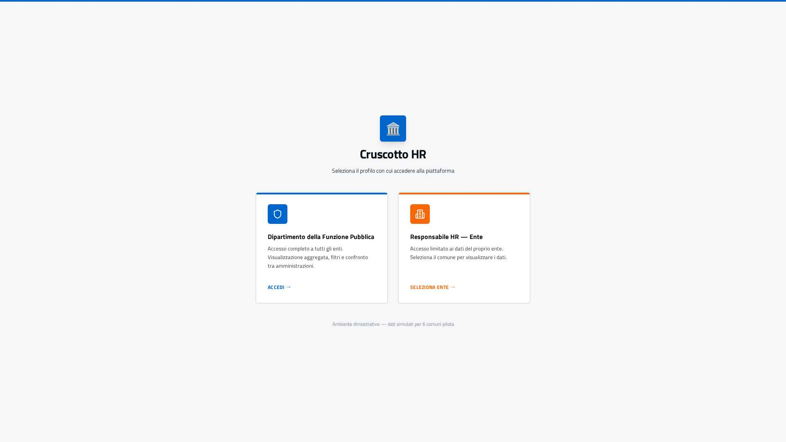
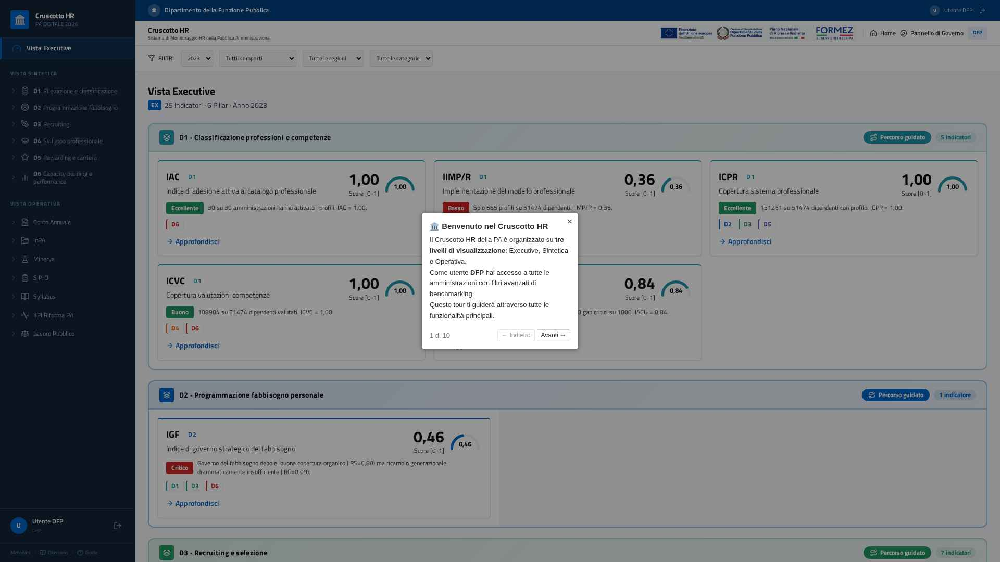
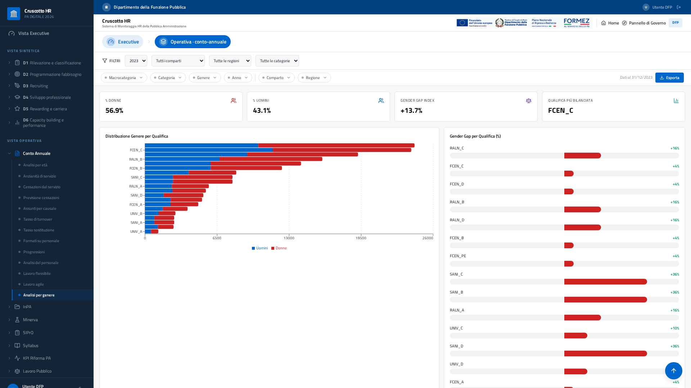

# Cruscotto HR — Report di Refactoring e Migrazione

**Preparato da:** Perfexia Srl
**Progetto:** Cruscotto HR — Sistema di monitoraggio HR della Pubblica Amministrazione
**Repository:** `github.com/Eligesoftsrl/cruscotto`
**Oggetto:** Sintesi completa e dettagliata degli interventi effettuati sul codice, dallo
stato iniziale (repository generata con Lovable) allo stato attuale, con esempi di
codice *prima/dopo* e schermate dell'applicazione.

---

## Indice

1. Sintesi esecutiva
2. Il punto di partenza: com'era il codice generato da Lovable
3. Stack tecnologico
4. Numeri del refactoring (a colpo d'occhio)
5. Confronto Prima / Dopo
6. L'applicazione oggi (schermate)
7. Architettura introdotta (Service Layer)
8. Esempi di codice reali — Prima / Dopo
   - 8.1 Un componente non parla più con il database (INPA)
   - 8.2 Un componente non usa più dati finti (Cessazioni)
   - 8.3 Come è fatto un "service" (Età)
   - 8.4 Come è fatto un "hook" (Età)
   - 8.5 Componenti riutilizzabili (KpiStat, ChartCard, SectionStates)
   - 8.6 Configurazione Supabase centralizzata (env-aware)
9. Dettaglio degli interventi (fase per fase)
10. Configurazione ambienti (online / locale)
11. Sicurezza e qualità (guardrail automatici)
12. Performance (code-splitting)
13. Verifiche di qualità effettuate
14. Cosa resta (debito tecnico, non bloccante)
15. Glossario dei termini tecnici

---

## 1. Sintesi esecutiva

Il progetto è stato importato da una repository generata con **Lovable** (uno strumento
di prototipazione rapida) e **completamente ristrutturato** per renderlo pulito,
manutenibile, sicuro e scalabile, **senza modificarne le funzionalità** per l'utente
finale. In estrema sintesi:

- Introdotta un'**architettura a livelli** (Service Layer) che separa nettamente
  l'accesso ai dati (Supabase) dalla logica di presentazione (i componenti a schermo).
- **Rimossi i dati finti (mock)** dalle sezioni operative, collegandole ai **dati reali**
  del data warehouse; i pochi indicatori privi di tabella sorgente sono chiaramente
  segnalati con un badge "dato dimostrativo".
- **Configurazione Supabase resa "environment-aware"**: lo stesso identico codice usa il
  database cloud in produzione e quello locale in sviluppo, senza modifiche manuali.
- **Rimosse le credenziali/URL scritte a mano nel codice** (hardcoded), sostituite dalla
  variabile d'ambiente `VITE_SUPABASE_URL`.
- **Corretti** tutti i bug e i warning di console segnalati.
- **Ottimizzate** le performance (code-splitting: la pagina iniziale è molto più leggera).
- Aggiunti **guardrail di qualità automatici** (regole di lint, test automatici) e rimosso
  il codice morto.
- Repository ripulita da ogni artefatto della piattaforma di sviluppo.

**Stato attuale:** applicazione funzionante, build di produzione OK, console pulita,
test verdi, pronta alla consegna.

---

## 2. Il punto di partenza: com'era il codice generato da Lovable

Lovable è ottimo per generare **rapidamente** un prototipo funzionante, ma il codice
che produce è pensato per "far vedere qualcosa che funziona", non per essere mantenuto
ed evoluto nel tempo da un team. Nel dettaglio, la versione iniziale presentava:

| Problema iniziale | Perché è un problema |
|-------------------|----------------------|
| Il client del database (Supabase) veniva **importato e usato direttamente dentro ~46 componenti grafici** | Ogni modifica alla struttura dati o alle query costringeva a toccare decine di file. Impossibile testare la logica in isolamento. |
| Molte sezioni mostravano **dati finti (mock)** scritti in file JavaScript | Il cliente vedeva numeri inventati, non i dati reali del data warehouse. |
| URL e chiavi del database **scritti a mano nel codice** (`localhost:8000`) | Non funzionava online; impossibile passare da sviluppo a produzione senza modificare il codice. |
| Query al database e trasformazioni dei dati **mescolate** dentro i componenti di UI | Codice difficile da leggere, da correggere e da riutilizzare; logica duplicata ovunque. |
| **Duplicazione massiccia** di griglie KPI, stati di caricamento, stili dei grafici | Ogni modifica estetica andava replicata a mano in ogni sezione. |
| Nessun **controllo di qualità** (lint mirato, test) | Facile introdurre regressioni senza accorgersene. |
| Bundle unico e monolitico (~1.9 MB) | Prima schermata lenta da caricare. |
| Componenti "orfani" (codice morto) mai rimossi | Confusione e peso inutile. |

In sostanza: **un prototipo valido come punto di partenza, ma non una base di codice
production-ready.** Il lavoro svolto ha trasformato questo prototipo in
un'applicazione professionale, mantenendo intatto ciò che l'utente vede e usa.

---

## 3. Stack tecnologico

React 18 + TypeScript + **Vite** · Tailwind CSS + shadcn/ui + Recharts ·
TanStack Query (React Query) · React Router · Supabase (PostgreSQL).

> Nota: l'app è una **Single Page Application (SPA)** basata su Vite, non su Next.js.

---

## 4. Numeri del refactoring (a colpo d'occhio)

| Metrica | Valore |
|---------|--------|
| Service creati (livello di accesso dati) | **18** (`src/services/dw/*`) |
| Hook dati resi "thin" e collegati ai service | **15** |
| Componenti che **non** importano più direttamente Supabase | **46** |
| Componenti totali della dashboard | **~100** |
| Peso del bundle iniziale | da **~1.9 MB** monolitico → **spezzato** in chunk on-demand |
| Regole ESLint anti-architettura | **1** (blocco import diretto di Supabase) — 0 violazioni |
| Test unitari sulle trasformazioni pure | verdi (harness Vitest riparato) |
| Credenziali/URL hardcoded rimossi | **tutti** → `VITE_SUPABASE_URL` |
| Warning/errori di console applicativi | **0** |

---

## 5. Confronto Prima / Dopo

| Aspetto | Prima (Lovable) | Dopo (refactoring) |
|--------|------------------|--------------------|
| Accesso ai dati | Client Supabase importato e usato **direttamente in ~46 componenti** | Centralizzato in un **Service Layer** (`src/services`); i componenti non toccano più Supabase |
| Dati delle sezioni | Molte sezioni su **dati mock** (JSON) | Sezioni collegate ai **dati reali** `dw_*`; demo residui segnalati con badge |
| Config Supabase | URL/chiavi hardcoded; `localhost:8000` non raggiungibile online | **Unica sorgente** `VITE_SUPABASE_URL`; cloud online, localhost in locale via `.env.local` |
| Hook dati | Query Supabase inline + trasformazioni nei componenti/hook | **Hook "thin"** che delegano ai service; trasformazioni in funzioni pure |
| Duplicazione UI | Griglie KPI, stati di caricamento e stili tooltip **duplicati** in ogni sezione | Componenti riutilizzabili: `KpiStat`, `ChartCard`, `SectionStates`, tema condiviso |
| Bundle | Unico chunk **~1.9 MB** | **Code-splitting**: vendor separati e pagine caricate on-demand |
| Gestione errori | Assente/silenziata | **Toast globale** su ogni query fallita |
| Qualità | Nessun guardrail | Regola ESLint anti-import diretto di Supabase + **unit test** |
| Tipizzazione | `any` diffuso | Service core del Conto Annuale **tipizzati** (tipi generati `Database`), 0 `any` |
| Codice morto | Componenti orfani duplicati | Rimossi |

---

## 6. L'applicazione oggi (schermate)

Le schermate seguenti documentano lo stato attuale dell'applicazione funzionante.

### 6.1 Accesso alla piattaforma
Pagina di login in stile AGID, con selezione del profilo (Dipartimento della Funzione
Pubblica / Responsabile HR di ente).



*Figura 1 — Pagina di accesso: selezione del profilo (DFP / Responsabile HR di ente) in stile AGID.*

### 6.2 Home di benvenuto
Punto di ingresso con scelta tra **Navigazione Guidata** (percorsi narrativi) e
**Vista Tecnica** (cruscotto per analisti).


*Figura 2 — Home di benvenuto: scelta tra Navigazione Guidata e Vista Tecnica.*

### 6.3 Vista Executive (indicatori reali)
Cruscotto sintetico con i 29 indicatori su 6 pillar (D1–D6), alimentati dai **dati reali**
del data warehouse.



*Figura 3 — Vista Executive: i 29 indicatori su 6 pillar (D1–D6) alimentati dai dati reali del data warehouse.*

### 6.4 Conto Annuale — Analisi per genere (grafici su dati reali)
Esempio di sezione operativa collegata alle tabelle `dw_*` reali: distribuzione di genere
per qualifica, Gender Gap Index e grafici Recharts.



*Figura 4 — Conto Annuale, "Analisi per genere": distribuzione per qualifica, Gender Gap Index e grafici Recharts su dati reali `dw_*`.*

---

## 7. Architettura introdotta (Service Layer)

```
src/
  config/        env.ts (variabili VITE_*), constants.ts (CURRENT_YEAR, ...)
  services/      Accesso dati + trasformazioni pure
    dw/          Un service per dominio (eta, genere, cessati, assunti, formazione,
                 modalita lavoro, progressioni, ente, iac, d1, inpa, kpiRilevazione,
                 lavoroPubblico, minerva, syllabus, sipro, bussola)
    journeysService.ts
  hooks/         Hook "thin": orchestrano React Query e chiamano i service
  fixtures/      Dati dimostrativi (ex-mock) usati SOLO come fallback esplicito
  components/
    dashboard/   Sezioni, grafici, primitive UI condivise
    ui/          Componenti shadcn/ui
  integrations/supabase/  client.ts (unico punto che istanzia il client)
  pages/         Route dell'app
```

**Principio chiave** — i componenti NON accedono mai direttamente a Supabase. Il flusso è:

```
Componente  →  Hook (React Query)  →  Service  →  Supabase
 (mostra)        (cache/stato)         (query      (database)
                                       + trasforma)
```

Una regola ESLint impedisce automaticamente di violare questa architettura (vedi §11).

---

## 8. Esempi di codice reali — Prima / Dopo

> Questa sezione mostra **codice reale** estratto dallo storico dei commit, per far
> toccare con mano quanto la base di codice sia stata trasformata.

### 8.1 Un componente non parla più con il database (INPA)

**PRIMA** — il componente importava Supabase e scriveva le query direttamente nella UI:

```diff
 import { useEffect, useState } from "react";
-import { supabase } from "@/integrations/supabase/client";
-import { useFilteredEnteIds, applyEnteFilter } from "@/hooks/useFilteredEnteIds";
+import { useFilteredEnteIds } from "@/hooks/useFilteredEnteIds";
+import { fetchInpaBandi, fetchEnteTotalCount } from "@/services/dw/inpaService";

   useEffect(() => {
     const load = async () => {
-      const { count: totCount } = await supabase.from("dw_ente").select("*", { count: "exact", head: true });
-      setTotPa(totCount ?? 0);
+      const totCount = await fetchEnteTotalCount();
+      setTotPa(totCount);

-      let q = supabase.from("dw_inpa_bandi").select("*");
-      q = applyEnteFilter(q, enteIds);
-      const { data: bandi } = await q;
+      const bandi = await fetchInpaBandi(enteIds);
       setAllBandi(bandi ?? []);
     };
     load();
```

**Perché conta:** il componente ora chiede "dammi i bandi INPA" senza sapere *come*
vengono recuperati. Se domani cambia la tabella o la query, si modifica **un solo
file** (il service), non decine di componenti.

### 8.2 Un componente non usa più dati finti (Cessazioni)

**PRIMA** — importava numeri inventati da un file di mock:

```diff
-import { cessazioniPerCausale, assuntiPerCausale, serieStoricaTurnover, kpiOverview } from "@/data/mockData";
+import { useCessatiData } from "@/hooks/useCessatiData";
+import { useAssuntiData } from "@/hooks/useAssuntiData";

 export const CessazioniSection = () => {
+  const { cessazioniPerCausale, serieStoricaCessati, kpiOverview, isLoading, error } = useCessatiData(2023);
+  const { assuntiPerCausale, serieStoricaTurnover: serieAssunti } = useAssuntiData(2023);
+
+  if (isLoading) return <div className="p-6 text-sm text-muted-foreground">Caricamento dati…</div>;
+  if (error) return <div className="p-6 text-sm text-destructive">Errore nel caricamento dei dati.</div>;
```

**Perché conta:** la sezione ora mostra i **dati reali** del data warehouse (con stati di
caricamento ed errore gestiti), non più valori di esempio.

### 8.3 Come è fatto un "service" (Età)

Ogni service ha una **funzione di trasformazione pura** (facilmente testabile) e una
**funzione di fetch** che parla con Supabase. Estratto reale da `etaService.ts`:

```ts
// Trasformazione PURA: nessuna dipendenza dal DB → testabile in isolamento
export function transformEtaData(rows: EtaRow[], fasce: FasciaEtaRow[]): EtaData {
  const order = new Map<string, { label: string; i: number }>();
  fasce.forEach((f, i) => order.set(String(f.codice), { label: String(f.classe ?? f.codice), i }));

  const agg = new Map<string, { uomini: number; donne: number }>();
  for (const r of rows) {
    const key = String(r.fascia_eta);
    const cur = agg.get(key) ?? { uomini: 0, donne: 0 };
    cur.uomini += Number(r.uomini) || 0;
    cur.donne  += Number(r.donne)  || 0;
    agg.set(key, cur);
  }
  // ...ordina per fascia anagrafica e calcola i totali...
}

// FETCH: unico punto che interroga Supabase per il dominio "età"
export async function fetchEtaData(anno?: number): Promise<EtaData> {
  const qb = supabase.from("dw_eta").select("fascia_eta, uomini, donne, anno");
  const [rowsRes, fasceRes] = await Promise.all([
    anno ? qb.eq("anno", anno) : qb,
    supabase.from("dw_fascia_eta").select("codice, classe, eta_min").order("eta_min"),
  ]);
  if (rowsRes.error) throw rowsRes.error;
  if (fasceRes.error) throw fasceRes.error;
  return transformEtaData(rowsRes.data ?? [], fasceRes.data ?? []);
}
```

**Perché conta:** la logica di calcolo (`transformEtaData`) è separata dal database e
**coperta da test unitari**. Il tipo dei dati (`Database[...]["Row"]`) è quello generato
da Supabase: niente più `any`.

### 8.4 Come è fatto un "hook" (Età)

L'hook è volutamente **sottile** ("thin"): orchestra la cache di React Query e delega
tutto al service. Estratto reale da `useEtaData.ts`:

```ts
export function useEtaData(anno?: number) {
  const { data, isLoading, error } = useQuery({
    queryKey: ["dw_eta", anno],
    queryFn: () => fetchEtaData(anno),   // ← delega al service
  });
  const { distribuzioneEta, totalePersonale } = data ?? EMPTY_ETA_DATA;
  return { distribuzioneEta, totalePersonale, isLoading, error };
}
```

**Perché conta:** caching, retry e gestione errori sono gratis grazie a React Query; il
componente riceve dati pronti + stati (`isLoading`/`error`).

### 8.5 Componenti riutilizzabili (fine della duplicazione)

Prima ogni sezione ridefiniva le proprie card KPI, i box di caricamento e i contenitori
grafico. Ora esistono **primitive condivise**. Esempio reale (`KpiStat.tsx`):

```tsx
export const KpiStat = ({ label, value, icon: Icon, color, sub }: KpiStatProps) => (
  <div className="bg-card border rounded-lg p-4">
    <div className="flex items-center justify-between">
      <div className="text-[10px] uppercase tracking-wider text-muted-foreground font-medium">{label}</div>
      <Icon className="h-4 w-4" style={color ? { color } : undefined} />
    </div>
    <div className="text-xl font-bold text-foreground mt-1">{value}</div>
    {sub && <div className="text-[10px] text-muted-foreground mt-0.5">{sub}</div>}
  </div>
);
```

Insieme a `ChartCard` (contenitore standard per i grafici) e `SectionStates`
(loading/errore/vuoto uniformi) e al `DemoDataBadge` per segnalare i dati dimostrativi:

```tsx
export const DemoDataBadge = ({ note }: { note?: string }) => (
  <div className="flex items-center gap-2 rounded-md border border-amber-300 bg-amber-50 px-3 py-2 text-[11px] text-amber-800">
    <Info className="h-3.5 w-3.5 shrink-0" />
    <span>{note ?? "Dati dimostrativi: questa sezione usa valori di esempio in attesa del caricamento delle tabelle sorgente."}</span>
  </div>
);
```

**Perché conta:** un'unica modifica al componente aggiorna l'aspetto in **tutte** le
sezioni. Meno codice, coerenza garantita.

### 8.6 Configurazione Supabase centralizzata (env-aware)

**PRIMA** — URL e chiave scritti a mano nel client, con `localhost:8000` non
raggiungibile online. **DOPO** — un'unica sorgente di verità (`src/config/env.ts`) e un
client che legge solo da lì:

```ts
// src/config/env.ts — UNICA sorgente delle variabili VITE_*
export const env: AppEnv = {
  supabaseUrl:     readEnv("VITE_SUPABASE_URL"),
  supabaseAnonKey: readEnv("VITE_SUPABASE_PUBLISHABLE_KEY"),
  supabaseProjectId: readEnv("VITE_SUPABASE_PROJECT_ID", { required: false }),
};

// src/integrations/supabase/client.ts — nessun valore hardcoded qui
export const supabase = createClient<Database>(env.supabaseUrl, env.supabaseAnonKey, {
  auth: { storage: localStorage, persistSession: true, autoRefreshToken: true },
});
```

**Perché conta:** stesso identico codice, **cloud online e localhost in locale**, senza
mai modificare i sorgenti (vedi §10).

---

## 9. Dettaglio degli interventi (fase per fase)

### 9.1 Import e configurazione ambiente
- Importato il progetto dalla repository e configurato per l'ambiente di sviluppo.
- `vite.config.ts` reso **environment-aware**: in locale porta **8080** (con fallback
  automatico su porta libera); in ambiente gestito porta da `PORT`, `allowedHosts` e HMR
  dedicati.

### 9.2 Configurazione Supabase (env-aware)
- Creato `src/config/env.ts`: **unica sorgente di verità** per le variabili
  `VITE_SUPABASE_*`, con validazione e messaggi d'errore chiari.
- `client.ts` legge la configurazione da `env.ts` (nessun valore hardcoded).
- Corretta l'incoerenza del `.env` (puntava a `localhost:8000` irraggiungibile online).
- Aggiunti `.env.example` e la logica `.env.local` (precedenza in locale, ignorato da
  git): **online = Supabase cloud, locale = Supabase su `localhost:8000`**, stesso codice.

### 9.3 Migrazione al Service Layer
- Estratte tutte le query Supabase dai **~46 componenti** (INPA, KPI, Lavoro Pubblico,
  Minerva, Syllabus, filtri globali, grafici SIPRO) verso **18 service** dedicati.
- **15 hook dati** resi "thin" e collegati ai service (eta, genere, bussola, cessati,
  assunti, formazione, progressioni, modalità lavoro, ente filtrati, IAC, D1, custom
  journeys, ecc.).

### 9.4 Conto Annuale: da mock a dati reali
- Verificato che le tabelle **`ca_*`** (Conto Annuale normalizzato) erano **vuote** e le
  **`dw_*`** popolate (conteggi reali: dw_eta 4.680, dw_occupazione 1.950, dw_cessati
  1.560, dw_assunti 1.894, dw_formazione/modalità 390). Per questo le sezioni cadevano
  sui mock.
- **Collegate ai dati reali `dw_*`**: Analisi Genere, Cessazioni, Progressioni, Lavoro
  Agile, Lavoro Flessibile, Tasso Turnover, Tasso Sostituzione, Formati Personale (oltre
  a Età e Assunti già reali), Analisi Età e Benchmark.
- **Badge "dato dimostrativo"** sulle sezioni prive di tabella sorgente in `dw_*`:
  Anzianità, Analisi Personale (titolo studio/serie storica), Previsione Cessazioni
  (proiezione simulata).
- **Rimosso codice morto**: componenti orfani `FlessibileSection`, `FormazioneSection`,
  `OverviewSection`.

### 9.5 Correzione bug / warning di console
- **Chiavi React duplicate** in `KpiAbilitantiSection` (con più enti): risolto aggregando
  i KPI per codice (media tra enti). Verificato: zero warning.
- **Errore SVG `<path d="Z">`**: guard sul RadarChart di `KpiSuccessRateSection` quando i
  dati sono vuoti.
- **Warning React Router**: abilitati i future flag v7 (`startTransition`,
  `relativeSplatPath`).
- Chiarito che gli errori residui (`content.js`, `polyfill.js`) provengono da **estensioni
  del browser**, non dall'app.

### 9.6 Riduzione verbosità e primitive riutilizzabili
- Create: `KpiStat` + `KpiGrid`, `ChartCard`, `SectionStates` (loading/errore/vuoto),
  `chartTheme` (tooltip condiviso), `lib/format` (formattazioni it-IT), `config/constants`,
  **barrel export** per `hooks` e `services/dw`.
- Applicate alle sezioni del Conto Annuale (UI uniforme, meno righe duplicate).

### 9.7 Tipizzazione (type-safety)
- I **7 service core** del Conto Annuale tipizzati con i **tipi generati** di Supabase
  (`Database[...]["Row"]`), **zero `any`**.

### 9.8 Qualità e guardrail
- Regola ESLint **`no-restricted-imports`**: vietato importare il client Supabase fuori
  dai service (0 violazioni). `no-explicit-any` a warning (rimozione progressiva).
- **Unit test (Vitest)** sulle funzioni pure di trasformazione (età, genere, cessati)
  verdi. Riparato il test harness.

### 9.9 Performance
- **Code-splitting**: route in `React.lazy` + `Suspense`; `manualChunks` per i vendor
  (React, Recharts, Supabase, React Query). Il bundle monolitico da ~1.9 MB è stato
  spezzato: la pagina di login NON carica più Recharts (446 KB), Supabase (220 KB) e la
  dashboard (454 KB), caricati solo all'ingresso nelle relative pagine.
- **Gestione errori globale** React Query (toast su query fallita).

### 9.10 Pulizia repository
- Rimossi dal repo (senza rompere l'ambiente) gli artefatti della piattaforma di sviluppo
  (`.emergent/`, `.gitconfig`, `memory/`, `test_reports/`, `test_result.md`) e aggiunti al
  `.gitignore`.
- `package.json`: `name` → `cruscotto-hr`. **README** riscritto con istruzioni di avvio
  locale, configurazione env-aware e architettura.
- Nessun riferimento alla piattaforma di sviluppo nel codice consegnato.

---

## 10. Configurazione ambienti (online / locale)

| Ambiente | File | `VITE_SUPABASE_URL` |
|----------|------|----------------------|
| Online (produzione) | `.env` | Supabase cloud |
| Locale (sviluppo) | `.env.local` (ignorato da git) | `http://localhost:8000` |

Avvio locale: `npm install` → creare `.env.local` → `npm run dev` (porta 8080).

Vite dà **sempre** precedenza a `.env.local` rispetto a `.env`: così lo stesso codice usa
il cloud online e il database locale in sviluppo, senza alcuna modifica ai sorgenti.

---

## 11. Sicurezza e qualità (guardrail automatici)

- **Nessuna credenziale/URL nel codice**: tutto passa da variabili d'ambiente `VITE_*`.
- **Regola ESLint anti-architettura** (`no-restricted-imports`): il client Supabase può
  essere importato **solo** dal service layer. Se un domani qualcuno prova a rimettere una
  query dentro un componente, il lint **fallisce** e blocca l'errore prima del rilascio.

```js
// eslint.config.js (estratto)
"no-restricted-imports": ["error", {
  patterns: [{
    group: ["@/integrations/supabase/client", "**/integrations/supabase/client"],
    message: "Importa Supabase solo nel service layer (src/services)."
  }]
}]
```

---

## 12. Performance (code-splitting)

Prima: un unico file JavaScript da **~1.9 MB** scaricato tutto in una volta, anche solo
per vedere la pagina di login.

Dopo: il codice è **spezzato** in blocchi caricati "on-demand". Concretamente, la pagina
di login **non** scarica più:
- la libreria dei grafici Recharts (~446 KB),
- il client Supabase (~220 KB),
- il codice della dashboard (~454 KB).

Questi vengono caricati **solo** quando si entra nelle relative pagine. Risultato: prima
schermata molto più leggera e reattiva.

---

## 13. Verifiche di qualità effettuate

- `tsc --noEmit` (type-check) **pulito** dopo ogni intervento.
- **Build di produzione** completata senza errori.
- **Console del browser pulita** (0 errori applicativi), verificata anche da test
  automatico.
- **Unit test** delle trasformazioni core verdi.
- **Verifica visiva** delle schermate principali (vedi §6).

---

## 14. Cosa resta (debito tecnico, non bloccante)

Vedi `TODO.md`. In sintesi, nessuno di questi item impatta il funzionamento attuale:

- **Tipizzazione forte dei grafici SIPRO** (13 file): sostituire l'entry point generico
  `sipoFrom` con funzioni `fetch` dedicate e tipizzate, rimuovendo gli `any` nelle
  trasformazioni multi-tabella.
- **Tipizzazione dei restanti service di dominio** (INPA, Minerva, Syllabus, Bussola, D1).
- **Centralizzazione delle query keys** in `src/services/queryKeys.ts`.
- **Estensione dei test** (assunti, formazione, modalità lavoro, indicatori IAC/D1).
- **Lato cliente (ETL):** popolamento delle tabelle `ca_*` per migrare le sezioni oggi
  "dato demo" (Anzianità, Titolo di studio, serie storiche) dai fixtures ai dati reali.
- **Autenticazione SSO/Keycloak** in sostituzione dell'attuale login dimostrativo.

---

## 15. Glossario dei termini tecnici

- **Refactoring**: riorganizzare il codice migliorandone la struttura interna senza
  cambiarne il comportamento esterno.
- **Service Layer (livello di servizio)**: strato di codice dedicato all'accesso ai dati,
  separato dalla parte grafica.
- **Hook**: funzione riutilizzabile di React che incapsula logica (qui: recupero dati e
  gestione cache).
- **Mock / fixtures**: dati finti di esempio usati al posto dei dati reali.
- **Bundle**: il pacchetto di codice JavaScript inviato al browser.
- **Code-splitting**: tecnica per suddividere il bundle in blocchi caricati solo quando
  servono.
- **Lint / ESLint**: strumento che analizza il codice e segnala (o blocca) errori e
  violazioni delle regole concordate.
- **Type-safety / TypeScript**: sistema di tipi che previene molti errori a tempo di
  scrittura, prima ancora di eseguire l'app.
- **Data Warehouse (`dw_*`)**: tabelle denormalizzate ottimizzate per l'analisi.
- **`ca_*` (Conto Annuale)**: schema normalizzato "a stella", da popolare via ETL.
- **ETL**: processo di estrazione, trasformazione e caricamento dei dati verso il
  data warehouse.
- **SSO / Keycloak**: sistema di autenticazione centralizzata (Single Sign-On).

---

*Documento generato a corredo del lavoro di refactoring. Per il dettaglio puntuale delle
modifiche fare riferimento allo storico dei commit del repository.*
